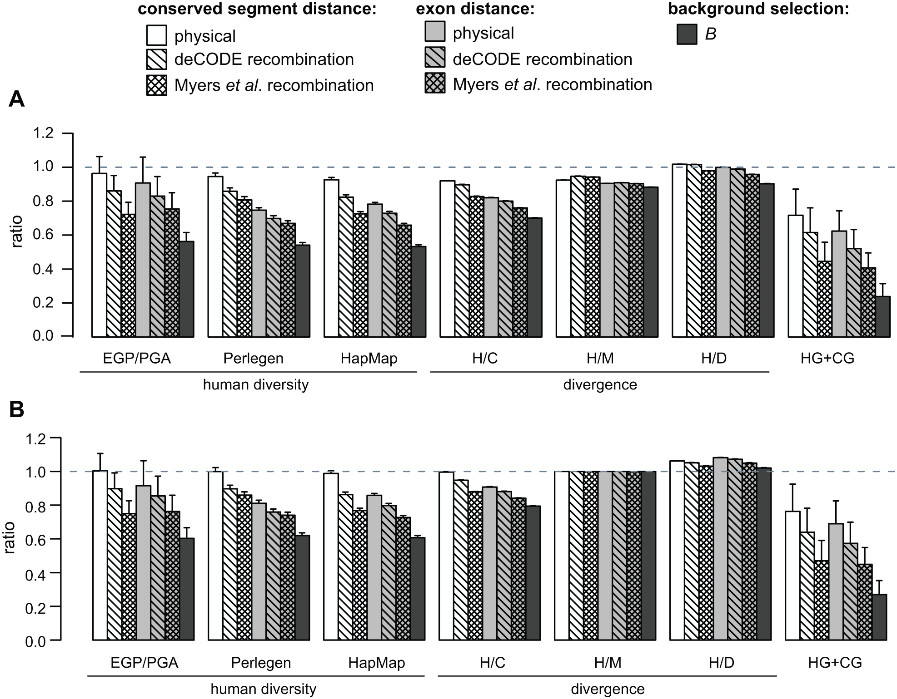
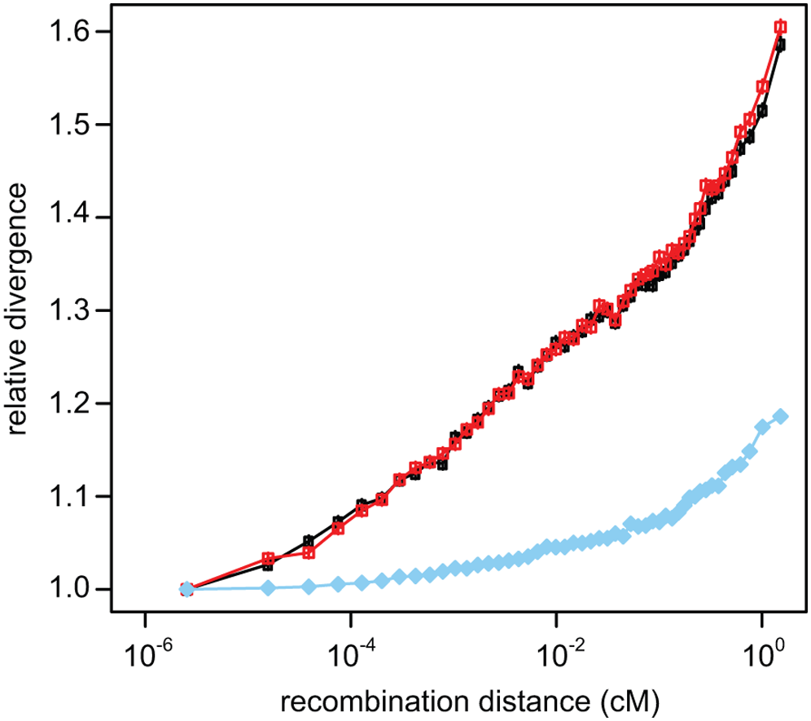
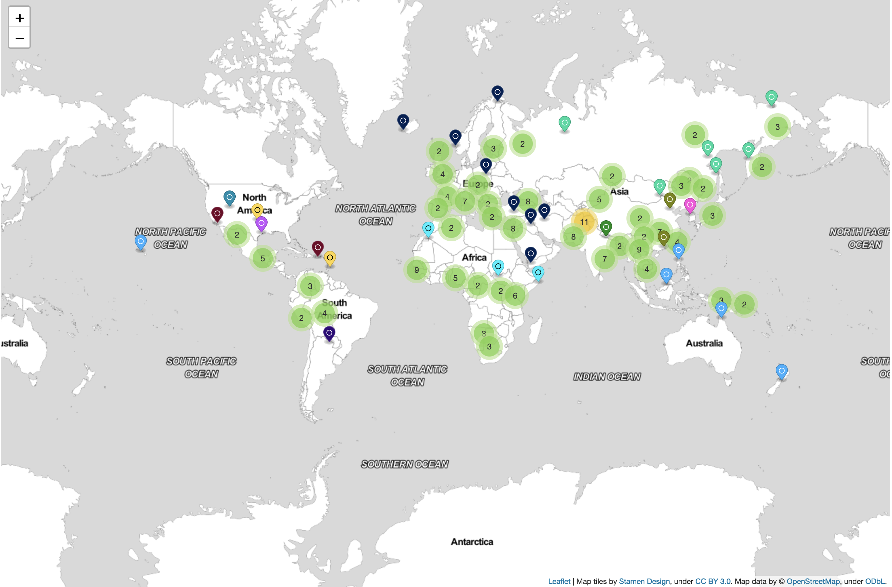

# Introduction

McVicker et al.^[McVicker, G., D. Gordon, and P. Green.  2009.  Widespread genomic signatures of natural selection in hominid evolution.  *PLoS Genetics*  [https://doi.org/10.1371/journal.pgen.1000471](https://doi.org/10.1371/journal.pgen.1000471)] used a different approach for detecting natural selection in the human genome than any that we discussed in lecture. Specifically, they

- Used a hidden Markov model to identify genome segments that are highly conserved across placental mammals.^[Don't worry about the mechanics of the model they used. Just take my word for it that it's a reasonable approach. If you're interested in knowing more, feel free to ask either in lecture or on Slack.] Some of the segments are in exons, and some lie outside exons. 

- Compared the amount of nucleotide sequence diversity (within humans) and the amount of nucleotide sequence divergence (between humans and chimps, humans and macaques, and humans and dogs) at the 10 percent of sites closest to the conserved segments with the diversity and divergence at the 50 percent of sites that were farthest away.^[They also looked in more detail at sequence differences in humans, chimps, gorillas, orangutans, and macaques. They then calculated the number of sites in the 10 percent of closest sites at which humans and chimps or humans and gorillas share a nucleotide different from the one found in the other other primates and compared it with the number of sites in the 50 percent of most distant sites. The results from looking at these sites were consistent with the broader diversity and divergence comparisons, so we won't dig into them.]

- Compared sequence divergence along the branch leading to humans with divergence along the branch leading to chimps and the branch leading to macaques.

Here are figures taken from the paper that illustrate the main patterns.

## Conclusions in McVicker et al.

McVicker et al. (2009) conclude that

> [O]ur analyses reveal a dominant role for selection in shaping genomic patterns of diversity and divergence

# Questions

As with Project #2, I am not asking you to analyze any data or run any simulations. I'm asking that you apply what you've learned about drift, selection, and evolution at the nucleotide sequence level to answer several questions related to the analyses they present and the conclusions that they draw.

1. What type of selection would explain nucleotide sequence conservation (i.e., lack of variation) in those genome segments where it is observed? 

2. How might focusing on sequences that are conserved affect the conclusions that McVicker et al. (2009) reach?

3. Why would the amount of divergence and diversity at (presumably neutral) sites depend on whether they are close to conserved segments or distant from them?

4. What evidence do the data provide that the SNPs identified as neutral are evolving in a way that is effectively neutral?

5. Are the patterns McVicker et al. found consistent with my claim that natural selection is primarily purifying? [http://darwin.eeb.uconn.edu/eeb348-notes/molevol-patterns.html#revising-the-neutral-theory](http://darwin.eeb.uconn.edu/eeb348-notes/molevol-patterns.html#revising-the-neutral-theory)

# More information about the data sets

The EGP/PGA, Perlegen, and HapMap data sets are three different data sets that provide information on single nucleotide polymorphisms in humans. 

- The EGP/PGA data set is derived from the NHLBI Program for Genomic Application of Seattle SNPs [https://pga.gs.washington.edu/](https://pga.gs.washington.edu/) and the NIEHS Environmental Genome Project [https://egp.gs.washington.edu/](https://egp.gs.washington.edu/). 

- Perlegen ceased operations in 2009 [https://www.ncbi.nlm.nih.gov/probe/docs/distrperlegen/](https://www.ncbi.nlm.nih.gov/probe/docs/distrperlegen/). 

- The resources provided by the International HapMap Project were removed in 2016 after a security audit.[https://www.ncbi.nlm.nih.gov/variation/news/NCBI_retiring_HapMap/](https://www.ncbi.nlm.nih.gov/variation/news/NCBI_retiring_HapMap/). 

- The International Genome Sample Resource (ISGR) is probably the best single publicly available source of data on nucleotide sequence variation in human populations.[https://www.internationalgenome.org/](https://www.internationalgenome.org/)

