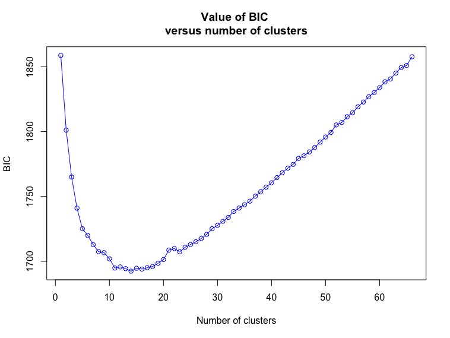

For [Lab 3](http://darwin.eeb.uconn.edu/eeb348-resources/Lab3.nb.html) we used data from Camak et al. (2021)^[Camak, D.T., M.J. Osborne, and T.F. Turner. 2021. Population genomics and conservation of Gila trout (*Onchorhyncus gilae*). *Conservation Genetics* [https://doi.org/10.1007/s10592-021-01355-0](https://doi.org/10.1007/s10592-021-01355-0).] to explore population structure using `LEA`. This week we're going to run a couple of additional analyses to explore these data further, ***and*** we're going to use the results from these analyses to re-examine some of the conclusions Camak et al. reached. I'll be asking you not only to produce numerical/graphical results from these analyses, but also to interpret what they mean biologically.

But first I have to introduce the methods, and we'll use the *Protea repens* data you've already seen to do that.

## PCA

First, we'll run a principal components analysis of the data. To do this we first have to get the data into `R` using `read.structure()` from `adegenet`.^[Remember that there are 662 genotypes (individuals), 173 markers (loci), column 1 contains the labels for genotypes (individuals), column 2 contains the population factor (the population/locality from which a particular sample was collected), there are no optional columns, row 1 contains the marker (locus) names, and genotypes are coded in two rows.]

<pre>
library(adegenet)
repens <- read.structure("http://darwin.eeb.uconn.edu/eeb348-resources/repens-outliers.stru")
</pre>

```{r}
summary(repens)
```

If we summarize the data, we'll see that nearly fifty percent of the data is missing, i.e., fifty percent of the individual/locus combinations are empty because we couldn't score that individual at that locus.^[We see this in the line labeled "Percentage of missing data".] This amount of missing data isn't uncommon with genotype-by-sequencing (GBS) data when you don't have a reference genome, but it is a problem for analysis by principal components. We fill the empty cells by replacing them with the mean allele frequency at the locus in question. This gives us complete data, but it understates the degree to which groupings in the data are different from one another. We also need a data frame that contains the population labels. Here's how we do those two things:^[Note: If you happen to have latitudes and longitudes for your collection sites, you could also add those to the data frame. Then you could plot individual points on a map colored by scores on one of the principal component axes.]

```{r}
repens_mod <- tab(repens, freq = TRUE, NA.method = "mean")
repens_df <- data.frame(Population = pop(repens))
```

Now we run the principal components analysis (PCA) and plot the results. ***IMPORTANT NOTE***: If you leave out the "u" in "colour" you won't get the results that you want.

```{r}
library(ggfortify)

repens_pca <- prcomp(repens_mod)
## must be spelled "colour" with a "u"
##
autoplot(repens_pca, data = repens_df, colour = "Population",
         frame.type = "norm") + 
  theme_bw()
```
With these data the first two principal components don't account for much of the variation, only a little more than 15%. None of the populations are cleanly distinguished from others, but there are a few that don't overlap. If you find the ellipses confusing, leave off the `frame.type` argument.

```{r}
autoplot(repens_pca, data = repens_df, colour = "Population") + 
  theme_bw()
```

## DAPC

DAPC is an acronym for "discriminant analysis of principal components". As the name suggests, it combines principal components analysis (like what we've just seen) with another statistical technique, discriminant analysis. Principal components analysis is used to reduce the number of dimensions in a data set without trying to tell groups apart. Discriminant analysis takes pre-defined groups and tries to find mathematical functions that can be used to "discriminate" among them.

The first step in a DAPC analysis is to find genetic clusters in the data. The `find.clusters()` function in `adegenet` uses a technique known as k-means clustering.^[Given K, this approach finds the center of K clusters such that each individual belongs to one cluster and the distance between every individual and the center of the cluster to which they belong is minimized. See [this Wikipedia article](https://en.wikipedia.org/wiki/K-means_clustering) for more details.] When you run `find.clusters()`, you'll be asked how many PCs to retain. You'll want to run this interactively on the console rather than through an R notebook so that you can answer the questions and see the plots before you answer

<pre>
clusters <- find.clusters(repens)
</pre>

In this case I picked 75 for the number of PCs to retain, because that gives me about 80 percent of the total variance. I picked 12 for the number of clusters, since that is the smallest BIC. Since 10-15 are all pretty close, if I were doing this for real, I'd probably look at the results for all of those possibilities to see if one made more sense than another.^[Depending on your data, the BIC plot may look more like the cross-entropy plot you saw with the gila trout data and `LEA` last week. In that case, pick a number of clusters that gives you close to the smallest BIC.]




Now you're ready to run `dapc()`. Specify the same number of PCs that you did with `find.clusters()`. Again you'll want to run this interactively, because `dapc()` will ask you how many discriminant functions to retain. There isn't a clear cutoff with these data, but there's a reasonably large jump from 3 to 4, and I picked 3.

<pre>
repens_dapc <- dapc(repens, pop = pop(repens), n.pca = 75)
</pre>


Once you've got that, then it's just a matter of plotting the results.

```{r}
scatter(repens_dapc)
```
The numbers in squares are the population labels (numbers from 1-19 in this case), the points correspond to individuals with the color matching the color of the population to which they belong, and the ellipses show the boundaries of where you expect most individuals belonging to that population to fall.

By default, `scatter()` plots the first two discriminant axes, but I specified three discriminant functions, so we can also plot axis 1 against axis 3 and axis 2 against axis 3 to get a more complete picture.

```{r}
scatter(repens_dapc, 1, 3)
scatter(repens_dapc, 2, 3)
```

As you can see, population 8 seems to separate a bit from the remaining populations in these plots.

Notice that if we compare the number of individuals belonging to each population before `dapc()`, i.e., the number collected in a particular location, it differs from the number belonging to each population after `dapc()`. This means that some individuals are more similar to those from other individuals from other collection sites than to individuals in the site where they were collected.

```{r}
library(tidyverse)

results <- data.frame(Initial = summary(repens_dapc)$prior.grp.size,
                      Final = summary(repens_dapc)$post.grp.size) %>%
  rename(Population = Initial.Var1,
         Initial = Initial.Freq,
         Final = Final.Freq) %>%
  select(-Final.Var1)
results
```

If we're interested, we can determine which individuals have been reclassified.

```{r}
results <- data.frame(Initial = repens_dapc$grp,
                      Final = repens_dapc$assign) %>%
  filter(Initial != Final)
results
```

You may or may not need to see which individuals have been classified, but at least you have the code to do so if you think it will be useful.

# Project 1

When you submit your project please remember to use this naming convention:

<pre>
Project1_first name_last name.extension
</pre>

For example,

<pre>
Project1_Kent_Holsinger.nb.html
</pre>

1. Use the data from [http://darwin.eeb.uconn.edu/eeb348-resources/gila-trout.stru](http://darwin.eeb.uconn.edu/eeb348-resources/gila-trout.stru) to perform a principal components analysis and a DAPC of genetic variation in gila trout from southwestern New Mexico. To read the data from this file you'll need to know that rhere are 154 individuals, the genotype ID is in column 3, and the population ID is in column 1. There is one extra column : column 2. There is not a row of allele names. Individuals appear on two lines rather than one. Be sure to say how many PCs you retained for the DAPC analysis and why you picked that number. Also be sure to say how many clusters you picked and how many discriminant functions you used.

2. Compare your results from this week's PCA and DAPC with last week's `LEA` analysis. Do you see noticeable differences among the patterns of genetic structure depending on the type of analysis you perform?

3. Camak et al. assert that "All lineages have experienced population bottlenecks associated with mortality from drought and severe wildfires." The data you have don't allow you to detect any effects of drought or wildfires, but are the patterns of genetic structure you detected consistent with population bottlenecks.^[This is stretching you a bit, since we won't talk about genetic drift for a couple of weeks, but you should be able to answer based on your basic understanding of biology.]

4. Given that we expect populations that are closer to one another to be more genetically similar, is the geographical distribution of the populations illustrated in Figure 1 of Camak et al. consistent with the results of your analyses?